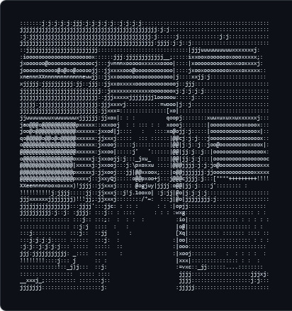
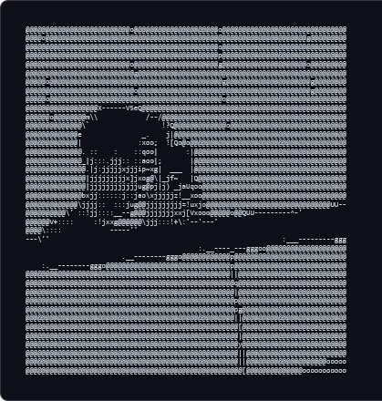
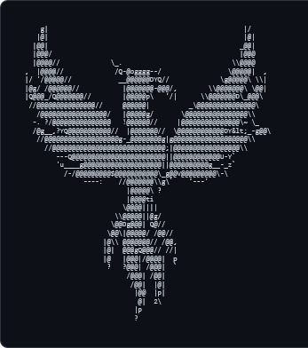
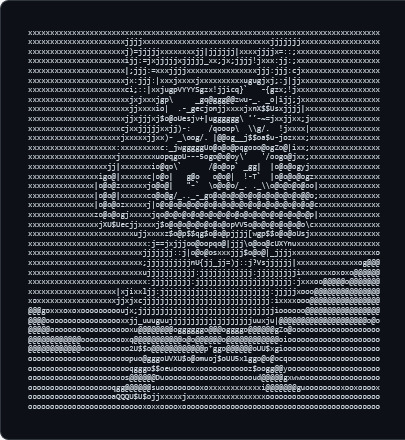

<!-- GANTI DENGAN BANNER KALIAN -->
<!--  -->

<h1>🚀 PVC Synovation</h1>

<strong>Khusus untuk Proyek Magang PT Sinovasi Idea Karya</strong>

<!-- Badge -->

  

---

## 📌 Tentang Kami

**PVC Synovation** adalah organisasi GitHub yang didedikasikan untuk mengelola seluruh proyek magang di **PT Sinovasi Idea Karya**. Kami fokus pada pengembangan solusi digital yang inovatif, efisien, dan scalable.

> 💡 *"Mengubah ide menjadi solusi digital yang nyata."*

### Visi & Misi
- 🎯 **Visi**: Menjadi wadah kolaborasi terbaik untuk pengembangan teknologi di lingkungan magang.
- 🚀 **Misi**: Membangun produk digital berkualitas tinggi dengan praktik pengembangan modern.

---

## ⭐ Proyek Unggulan

<table>
  <tr>
    <td width="50%" valign="top">
      <h3>📧 E-Office Correspondence</h3>
      

        
        
        
      

      
Sistem surat menyurat digital untuk internal perusahaan. Memudahkan pengelolaan arsip surat, disposisi, dan tracking status surat secara real-time.

      
    </td>
    <td width="50%" valign="top">
      <h3>📍 FeriPressense</h3>
      

        
        
        
      

      
Aplikasi presensi berbasis mobile yang dibangun dengan Flutter. Dilengkapi dengan fitur geolocation, face recognition, dan laporan otomatis.

      
    </td>
  </tr>
</table>

---

## 🛠️ Tech Stack

### Backend & Server

  
  
  

### Mobile & Frontend

  
  
  
  

### Tools & DevOps

  
  
  
  

---

## 👥 Tim Kami

<table>
  <tr>
    <td align="center">
      <a href="https://github.com/Faraysz">
        <picture>
          <source media="(prefers-color-scheme: dark)" srcset="atma.png">
          
        </picture>
         
        <b>Atma</b>
      </a>
    </td>
    <td align="center" >
      <a href="https://github.com/yowput">
        <picture>
          <source media="(prefers-color-scheme: dark)" srcset="putra.png">
          
        </picture>
         
        <b>Putra</b>
      </a>
    </td>
    <td align="center" >
      <a href="https://github.com/FeniksZharovik">
        <picture>
          <source media="(prefers-color-scheme: dark)" srcset="feniks.png">
          
        </picture>
         
        <b>Feniks</b>
      </a>
    </td>
    <td align="center" >
      <a href="https://github.com/adeliaputri7">
        <picture>
          <source media="(prefers-color-scheme: dark)" srcset="adel.png">
          
        </picture>
         
        <b>Adel</b>
      </a>
    </td>
  </tr>
</table>

---

📖 Baca [CONTRIBUTING.md](./CONTRIBUTING.md) untuk panduan lengkap.

---

## 📊 Statistik Organisasi

  

---

## 📬 Kontak

---

  
Made with 💻 by <strong>PVC Synovation Team</strong>

  
© 2026 Internship PT Sinovasi Idea Karya. All rights reserved.

